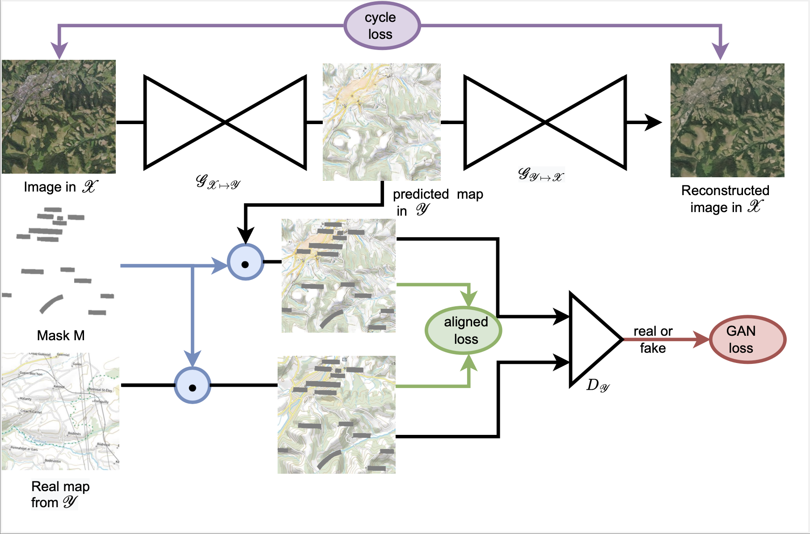
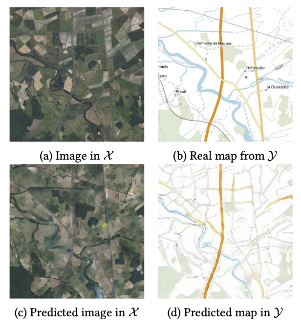

# Adversarial Map Generation
This repository is forked from [pytorch-CycleGAN-and-pix2pix](https://github.com/junyanz/pytorch-CycleGAN-and-pix2pix). It aims at using CycleGAN as a basis for style transfer and modify it in two key ways (to have an Adversarial Map Generation framework):
- Handling Text: detection and masking strategy to prevent inconsistent supervisory signal.
- Alignment Supervision: exploit the natural alignment of maps/orthophotography.

## Introdcution
We consider the problem of automatically converting an aerial orthophotography into a legible map of arbitrary style. We address this task from an image-to-image translation perspective, and use both modern maps and historical maps spanning several centuries. Maps are inherently different from natural images: they rely on symbolic representations, contain text for named entities, and can be easily aligned with aerial images. We propose to exploit these unique properties to adapt the CycleGAN adversarial generative model for our problem. Our modifications significantly improve the legibility of generated maps.

<table style="width:100%; table-layout:fixed;">
	<tr>
		<td></td>
	</tr>

</table>


__Adversarial Map Generation Framework.__ The model consists of two mapping functions  and  and an associated adversarial discriminators  and .
</tr>


## Datasets
We are using the [Plan IGN](https://www.geoportail.gouv.fr) dataset. To get the text annotated dataset, we evaluated [TESTER](https://github.com/mlpc-ucsd/TESTR) using the [TotalText pre-trained model](https://ucsdcloud-my.sharepoint.com/:u:/g/personal/xiz102_ucsd_edu/ESwSFxppsplEiEaUphJB0TABkIKoRvIljkVIazPUNEXI7g?e=Q8zJ0Q) on the Cassini dataset. For more information on how to evaluate [TESTR](https://github.com/mlpc-ucsd/TESTR), please refer to the [README](https://github.com/mlpc-ucsd/TESTR/blob/main/README.md).

Extract text annotated Plan IGN under [datasets](./datasets) and make sure you organize it as follows:

```
- datasets
  | - PlanIGN
  |   | - testA
  |   | - testB
  |   | - trainA
  |   | - trainB
  |   | - valA
  |   | - valB
```
where ortho images placed under A and maps placed under B.

## Prerequisites
- Linux or macOS
- Python 3.7
- CUDA 11.7
- PyTorch 1.11.0
- visdom 0.1.8
- dominate 2.4.0


## Environment setup

Create and install environment for conda users:

```bash
# Create and install environment
conda env create -f environment.yml
# Activate environment
conda activate AdversarialMapGeneration
```

for pip users:

```bash
# Create environment
python3 -m virtualenv .venv --python=python3.7

# Install environment
.venv/bin/pip install -r requirements.txt

# Activate environment
source .venv/bin/activate
```


## Train/Test Adversarial Map Generation
To train Adversarial Map Generation on the Plan IGN maps dataset (should be placed in [datasets](./datasets)), run:

```bash
python train.py --dataroot ./datasets/PlanIGN --name planIGN_AdversarialMapGeneration --model cycle_gan
```
To see more intermediate results, check out `./checkpoints/planIGN_AdversarialMapGeneration/web/index.html`.

To test the model, run:
```bash
python test.py --dataroot ./datasets/PlanIGN --name planIGN_AdversarialMapGeneration --model cycle_gan
```
The test results will be saved to a html file here: `./results/planIGN_AdversarialMapGeneration/latest_test/index.html`.

## Results


<table style="width:100%; table-layout:fixed;">
	<tr>
		<td></td>
	</tr>
</table>

__Adversarial Map Generation Success Results on Plan IGN__. The input data image in (a) and its corresponding real map in (b), the output map ) in (c), and the output image ) in (d) from our method Adversarial Map Generation experiment on Plan IGN. Results are from top to bottom: image  map.
